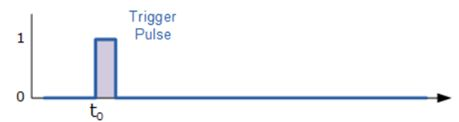
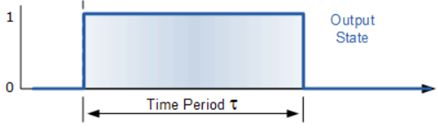
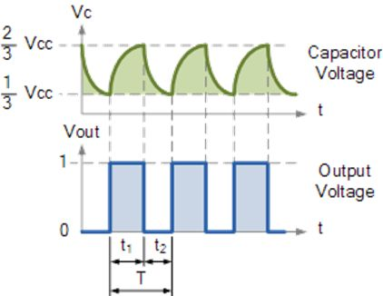

# LEKCJA 2

**1\. Wprowadzenie:**

W tej lekcji zapoznasz się z działaniem układu scalonego **NE555** pracującego w dwóch trybach:

- **Astabilnym** – generującym ciągły przebieg prostokątny (migająca dioda),
- **Monostabilnym** – generującym jeden impuls o określonej długości po naciśnięciu przycisku.

Układ zbudowany jest na gotowej płytce PCB, zasilanej baterią 9V. Diody LED wskazują działanie układów:

- DS2 – dioda zasilania,
- DS3 – dioda astabilna (migająca),
- DS1 – dioda monostabilna (świeci po naciśnięciu przycisku przez określony czas).

**2\. Wstęp techniczny**

**Tryb monostabilny (górna część płytki)**

- Po naciśnięciu przycisku **SW2** generowany jest **pojedynczy impuls**, widoczny jako **świecenie diody DS1** przez pewien czas.
- Czas trwania impulsu zależy od wartości **rezystora R1** i **kondensatora C1**.

Rys. 1 Przykładowe przebiegi układu monostabilnego: impuls triggerujący (górny), odpowiedź układu na wyjściu – TP3 (dolny)

**Wzór na czas trwania impulsu (czas włączenia diody):**

_(R1 w omach, C1 w faradach, wynik w sekundach)_

**Tryb astabilny (dolna część schematu)**

- Układ automatycznie generuje przebieg prostokątny – **dioda DS3 miga**.
- Przebieg charakteryzuje się częstotliwością i współczynnikiem wypełnienia.

  
Rys.2 Przykładowe przebiegi: na kondensatorze C2 (górny), wyjściowy – TP5 (dolny)

**Wzory dla trybu astabilnego:**

Czasy:

Całkowity okres:

Częstotliwość:

Współczynnik wypełnienia:

**3\. Zadania do wykonania:**

**Zadanie 1 – Tryb monostabilny**

1. Zamontuj w miejscach na R1 i C1 odpowiednio rezystor i kondensator: 91 kΩ i 10 μF
2. Naciśnij przycisk SW2 i obserwuj czas świecenia diody DS1.
3. Zmierz czas po jakim dioda zgasła
4. Zmień wartości **R1** i **C1**
5. Oblicz nowy czas trwania impulsu i porównaj z pomiarem „na oko” lub stoperem.
6. Odpowiedz:
    - Jak zmienia się czas świecenia, gdy zwiększysz pojemność kondensatora?
    - Co się stanie, gdy zmniejszysz wartość rezystora?
    - Wymyśl przykładowe zastosowania takiego układu (wciśnięcie przycisku z określonym czasem reakcji)

**Zadanie 2 – Tryb astabilny**

1. Obserwuj diodę DS3 – jak szybko miga?
2. Zmień wartości **R2**, **R3** i **C2**, aby:
    - dioda migała szybciej (częstotliwość ↑),
    - dioda migała wolniej (częstotliwość ↓),
    - zmienić czas świecenia względem czasu przerwy (zmień współczynnik wypełnienia).
3. Postaraj się tak dobrać elementy żeby dioda była na granicy migotania
4. Oblicz wartości **częstotliwości** i **wypełnienia** na podstawie aktualnych elementów.
5. Odpowiedz:
    - Wymyśl przykładowe zastosowania takiego układu (kontrolowany czas przełączania układu)

**4\. Pytania sprawdzające:**

- Jakie są różnice między trybem monostabilnym i astabilnym NE555?
- Co się stanie, jeśli kondensator w trybie monostabilnym będzie bardzo mały?
- Dlaczego nie widzimy migania diody powyżej 50 Hz?
- Który z elementów (R czy C) ma większy wpływ na częstotliwość pracy układu astabilnego?