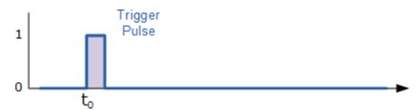
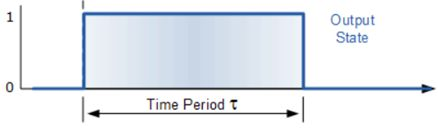
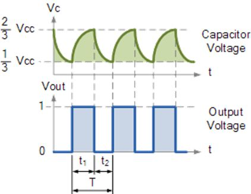

# LEKCJA 2

## 1. Wprowadzenie

W tej lekcji zapoznasz się z działaniem układu scalonego **NE555** pracującego w dwóch trybach:

- **Astabilnym** – generującym ciągły przebieg prostokątny (migająca dioda),
- **Monostabilnym** – generującym jeden impuls o określonej długości po naciśnięciu przycisku.

Układ zbudowany jest na gotowej płytce PCB, zasilanej baterią 9V. Diody LED wskazują działanie układów:

- **DS2** – dioda zasilania,
- **DS3** – dioda astabilna (migająca),
- **DS1** – dioda monostabilna (świeci po naciśnięciu przycisku przez określony czas).

## 2. Wstęp techniczny

### Tryb monostabilny (górna część płytki)

Po naciśnięciu przycisku **SW2** generowany jest pojedynczy impuls, widoczny jako świecenie diody **DS1** przez pewien czas.

Czas trwania impulsu zależy od wartości rezystora **R1** i kondensatora **C1**.

**Rys. 1** Przykładowe przebiegi układu monostabilnego: impuls triggerujący (górny), odpowiedź układu na wyjściu – **TP3** (dolny)

**Wzór na czas trwania impulsu (czas włączenia diody):**

$$
t = 1{,}1  \cdot R1 \cdot C1
$$

> gdzie:  
> R1 w omach (Ω),  
> C1 w faradach (F),  
> wynik w sekundach (s)

### Tryb astabilny (dolna część schematu)

Układ automatycznie generuje przebieg prostokątny – dioda **DS3** miga.

Przebieg charakteryzuje się **częstotliwością** i **współczynnikiem wypełnienia**.

 **Rys. 2** Przykładowe przebiegi: na kondensatorze **C2** (górny), wyjściowy – **TP5** (dolny)

**Wzory dla trybu astabilnego:**

Czasy: [\[1\]](#footnote-0)
$$
t_{\text{high}} = \ln(2) \cdot (R2 + R3) \cdot C2 
$$
$$
t_{\text{high}} = 0{,}693 \cdot (R2 + R3) \cdot C2
$$
$$
t_{\text{low}} = 0{,}693 \cdot R3 \cdot C2
$$
Całkowity okres:
$$
T = t_{\text{high}} + t_{\text{low}}
$$
Częstotliwość:
$$
f = \frac{1}{T}
$$
Współczynnik wypełnienia:
$$
D = \frac{t_{\text{high}}}{T} \cdot 100\%
$$

## 3. Zadania do wykonania

### Zadanie 1 – Tryb monostabilny

- Zamontuj w miejscach na **R1** i **C1** odpowiednio rezystor i kondensator: **91 kΩ** i **10 μF**
- Naciśnij przycisk **SW2** i obserwuj czas świecenia diody **DS1**
- Zmierz czas po jakim dioda zgasła
- Zmień wartości **R1** i **C1**
- Oblicz nowy czas trwania impulsu i porównaj z pomiarem „na oko” lub stoperem

**Odpowiedz:**

- Jak zmienia się czas świecenia, gdy zwiększysz pojemność kondensatora?
- Co się stanie, gdy zmniejszysz wartość rezystora?
- Wymyśl przykładowe zastosowania takiego układu (wciśnięcie przycisku z określonym czasem reakcji)

### Zadanie 2 – Tryb astabilny

- Obserwuj diodę **DS3** – jak szybko miga?
- Zmień wartości **R2**, **R3** i **C2**, aby:
  - dioda migała szybciej (częstotliwość ↑),
  - dioda migała wolniej (częstotliwość ↓),
  - zmienić czas świecenia względem czasu przerwy (zmień współczynnik wypełnienia).
- Postaraj się tak dobrać elementy żeby dioda była na granicy migotania
- Oblicz wartości częstotliwości i wypełnienia na podstawie aktualnych elementów

**Odpowiedz:**

- Wymyśl przykładowe zastosowania takiego układu (kontrolowany czas przełączania układu)

## 4. Pytania sprawdzające

1. Jakie są różnice między trybem monostabilnym i astabilnym NE555?
2. Co się stanie, jeśli kondensator w trybie monostabilnym będzie bardzo mały?
3. Dlaczego nie widzimy migania diody powyżej 50 Hz?
4. Który z elementów (**R** czy **C**) ma większy wpływ na częstotliwość pracy układu astabilnego?

1. ln() – jest to logarytm naturalny, w fizyce i matematyce często występuje stała oznaczana jako e – liczba Eulera. W tym przypadku wykorzystywana jest do obliczania czasu rozładowywania kondensatora z układu RC. Ln – oznacza logarytm o podstawie e - $$ln⁡()=log_n ()$$ln⁡(2)≈0,693, stąd dalsze uproszczenia. [↑](#footnote-ref-0)