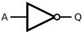
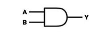
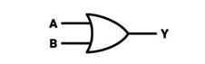
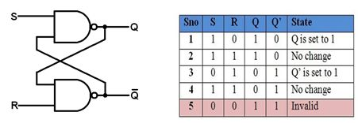
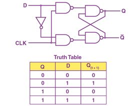
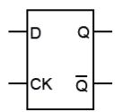
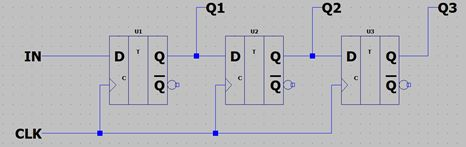
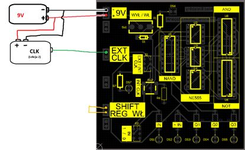

# NE555 Lekcja 3: Układ cyfrowy

## Wstęp

Większość współczesnego świata operuje układach cyfrowych. Na każdym kroku masz do czynienia z takimi układami elektronicznymi, nawet gdy nie zdajesz sobie z tego sprawy. Czym one dokładnie są oraz od czego zacząć? Mam nadzieję, że uda się na te pytania odpowiedzieć.

## Układ cyfrowy

Podczas gdy my liczymy w systemie dziesiętnym (od 0 do 9), komputery, a co za tym idzie układy cyfrowe, operują na systemie binarnym (0 albo 1).

**Układ cyfrowy** to właśnie taki układ elektroniczny, w którym definiujemy nie dokładne napięcie, lecz patrzymy jedynie czy wartość jest niska, czy wysoka. Gdy napięcie jest niskie (ok. 0 V) to przypisujemy mu wartość 0, a gdy wysokie (napięcie zasilania, u nas ok. 9 V) to mamy wartość 1.

## Bramki logiczne

Najmniejszym elementem układu cyfrowego jest bramka logiczna. Na nasz użytek nazwijmy to skrzynką, do której możemy dać pewne wartości, a otrzymamy na wyjściu pewien wynik.

Najbardziej podstawową bramką jest bramka **NOT.** Jej jedyna funkcją jest zamiana wartości.

Tablica prawdy bramki NOT

| A   | Y = ~ A |
| :---: | :---: |
| 0   | 1   |
| 1   | 0   |

Następnymi w kolejności są bramki **AND** i **OR**. Wprowadzają one dodatkowy element, a mianowicie, wyjście zależy od dwóch wejść.

|     |     | AND | OR  |
| :---: | :---: | :---: | :---: |
| A   | B   | Y = A ∩ B | Y = A ∪ B |
| 0   | 0   | 0   | 0   |
| 0   | 1   | 0   | 1   |
| 1   | 0   | 0   | 1   |
| 1   | 1   | 0   | 1   |

## Wprowadzenie do projektu

Pierwszym eksperymentem jaki wykonamy będzie obserwacja bramki NOT. Po podłączeniu zasilania przestawmy przełącznik IN w pozycję 0 (w stronę brzegu płytki). Dioda LED z opisem „IN” powinna być ciemna, a wtedy LED z opisem „~ IN” powinien być zapalony. Obserwujemy zachowanie bramki NOT w momencie gdy wejście (IN) ma wartość 0, a wyjście (~ IN) ma wtedy wartość 1. Po zmianie stanu przełącznika na pozycję 1, stany LEDów się zmieniły, IN ma wartość 1, a ~ IN wartość 0.

Samą bramkę możemy zaobserwować w postaci układu CD4049, w którym znajduje się 6 takich bramek logicznych. Właśnie jedna z nich została użyta w tym eksperymencie. Na płytce znajdują się też 4 bramki AND w układzie CD4081 oraz 4 bramki NAND[\[1\]](#footnote-0) w układzie CD4011. Na samym środku znajdują się 3 układy NE555.

## Projekt rejestru przesuwnego

**Rejestr przesuwny** to układ cyfrowy zbudowany z kilku przerzutników, w którym dane (bity) są **przesuwane** z jednego przerzutnika do następnego przy każdym impulsie zegarowym.

Gdy spojrzy się uważniej do datasheeta układu NE555 składa się on tak właściwie z **zatrzasku SR** (ang. SR Latch). SR jest od nazw wejść SET oraz RESET.

Stanowi on podstawę do zbudowania znacznie częściej wykorzystywanego układu **przerzutnika D** (ang. D flip-flop). Zmienia on swój stan na wyjściu zależnie od stanu na wejściu, lecz tylko gdy stan zegara zmieni się z 0 na 1.

Aby stworzyć rejestr przesuwny jest więc tylko połączenie takich przerzutników jeden za drugim:

Z każdą zmianą stanu zegara, stan na wejściu będzie przekazywany do kolejnych wyjść Q.

### Uruchomienie

Aby włączyć rejestr przesuwny należy zewrzeć wyjście zewnętrzne płytki podpisane **SHIFT REG WŁ.** Upewniamy się, że przełącznik **CLK** jest w pozycji **INT** (ang. internal, zegar który będziemy sami wywoływać). Teraz z każdym wciśnięciem przycisku **INT CLK** stan na wejściu **IN** będzie się przesuwał po kolejnych wyjściach przerzutnikach **Q1**, **Q2** i **Q3**.

W układach wykorzystywanych powszechnie jednak nie stosuje się takich manualnych zegarów. Zazwyczaj podłączamy je do zegara, który wyznacza częstotliwość działania takiego układu. W celu demonstracyjnym zastosujemy zegar o bardzo niskiej częstotliwości, aby było gołym okiem widać jego zmiany, a z tyłu głowy można mieć informację że taki układ działałby (zależnie od zastosowania) od kilkuset kHz (energooszczędne układy) do nastu GHz (komputery).

W celu wykorzystania stałego zegara przygotowane jest wejście **EXT CLK**, do którego możemy podłączyć zegar przygotowany w lekcji 2.

Uwaga! Podłączając 2 płytki, upewnijmy się że są zasilone z 1 baterii, ewentualnie mają połączone ujemne zasilanie.

Sygnał zegarowy powinien zostać doprowadzony do górnego pinu opisanego jako **EXT CLK**, a przełącznik **CLK** na pozycję **EXT**.

1. Bramka NAND to tak właściwie bramka AND z bramką NOT na wyjściu [↑](#footnote-ref-0)