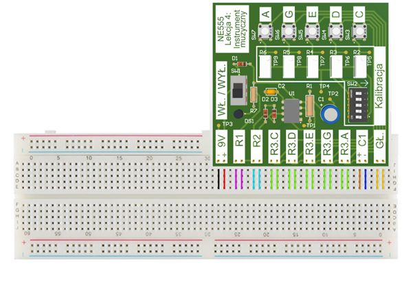
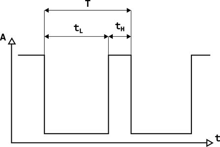
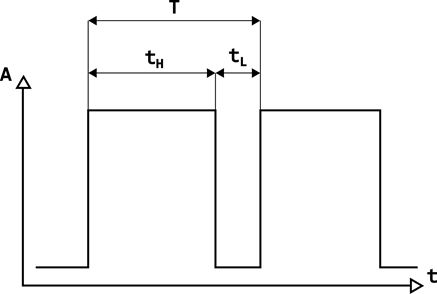

# NE555 Lekcja 4: Instrument muzyczny

**Cel projektu**

W tym projekcie jako inżynier elektronik będziesz musiał(a) obliczyć i dobrać odpowiednie elementy pasywne - rezystory R1, R2 i R3 oraz kondensator C1, tak aby zbudować prosty instrument muzyczny w stylu elektronicznego pianina. Dodatkowo takie pianino będziesz musiał(a) nastroić zgodnie z gamą pentatoniki.

**Pentatonika**

Pentatonika to skala muzyczna składająca się z 5 dźwięków. Ze względu na jej prostotę wykorzystana będzie jako wzór do nastrojenia projektowanego instrumentu. Z punktu widzenia projektanta potrzebna będzie znajomość z jakimi częstotliwościami powinien oscylować generator sygnału NE555. Zapoznaj się z poniższą tabelą.

| Nazwa dźwięku | Fizyczna częstotliwość drgań \[Hz\] |
| :---: | :---: |
| C   | 261,63 |
| D   | 293,6 |
| E   | 329,63 |
| G   | 392,00 |
| A   | 440,00 |

**Opis układu**

Pokazany na poniższym rysunku układ na płytce to zwykły układ NE555 podłączony w układzie astabilnym. Działa tutaj jako oscylator wydający dźwięki.

- Mamy dostępne miejsca na podłączenie rezystorów R1 i R2, które ustalają częstotliwość dźwięku oraz wypełnienie wspólnie dla wszystkich klawiszy.  

- Dostępne jest też 5 miejsc na rezystory R3. Każdy taki rezystor jest podłączany przez przycisk co włącza go w układ i włącza oscylator. Każdym przyciskiem można wydawać inny dźwięk.  

- Wszystkie 5 ścieżek do wyboru dźwięku łączy się w punkcie do którego podłączony jest kondensator C1. Jest on wspólny do ustalania częstotliwości wszystkich dźwięków.

**Podłączenie układu**

Płytka wyposażona jest w złącza “goldpin”, które wystają na dole płytki. Płytkę należy wpiąć za pomocą tych złączy w płytkę stykową aby połączyć ścieżki i mieć wygodny dostęp do złączy. Zmontuj układ zgodnie z poniższym rysunkiem.

Kolorowe paski na płytce stykowej wskazują gdzie podłączone zostały złącza do różnych elementów płytki, które będą podłączone do niej na płytce stykowej.

UWAGA: Uważaj na polaryzację elementów! Jeżeli podłączysz baterię odwrotnie nic się nie stanie, ponieważ układ jest zabezpieczony, ale unikaj takich sytuacji. **Jeżeli podłączysz odwrotnie kondensator elektrolityczny C1, to może spowodować uszkodzenie płytki, a nawet eksplozję kondensatora!**

Instrukcja ustawienia płytki przed eksperymentem:

Ustaw włącznik “SW1” w pozycji “WYŁ”

Podłącz “-” baterii 9V do ścieżki oznaczonej na czarno.

Podłącz “+” baterii 9V do ścieżki oznaczonej na czerwono.

Ustaw wszystkie przełączniki “SW2” w pozycji wskazywanej przez strzałkę obok.

Podłącz głośnik do złącza “GŁ.” (brak polaryzacji).

Włącz zasilanie płytki włącznikiem SW1. Jeżeli LED zaczął się świecić to znaczy, że układ jest gotowy do pracy. Wyłącz zasilanie aby oszczędzić baterię.

**Obliczenia elementów**

Twoim zadaniem jest dobranie elementów R1, R2, R3 (5 różnych R3 dla 5 różnych dźwięków) i C1 w zmodyfikowanym układzie astabilnym NE555 (czyli oscylator) tak aby jego sygnał wyjściowy, który podawany jest na głośnik i zamieniany na dźwięk, oscylował z częstotliwościami zapisanymi w skali pentatoniki (tabela 1.). Możesz posłużyć się poniższymi wzorami aby znaleźć wartości:

<u>Pamiętaj, że masz ograniczoną liczbę wartości elementów, ale zawsze możesz je łączyć szeregowo lub równolegle aby tworzyć nowe wartości!</u>

$$
t_H \approx 0.7 \cdot (R2 + R3) \cdot C1
$$
$$
t_L \approx 0.7 \cdot (R1 + R3) \cdot C1
$$
$$
f \approx \frac{1}{t_L + t_H}
$$

Spójrz na schemat. W tym układzie rezystory R1 i R2 nie tylko zmieniają częstotliwość, ale też określają jak długo będzie ładować $t_L$ a jak długo rozładowywać kondensator $t_H$ w każdym okresie. Na początku ustal **R1 = R2**. Później zobaczysz, co się stanie gdy wartości będą różne.

**Dobierz elementy tak aby osiągnąć częstotliwości jak najbliższe tym podanym powyżej. Potem będziemy mogli je precyzyjnie dostroić za pomocą rezystorów o regulowanej rezystancji - potencjometrów (sekcja “Kalibracja” na PCB).** **Gdy znajdziesz odpowiednie wartości, podłącz wszystkie wartości do układu po kolei tak aby każdy dźwięk w tabeli odpowiadał przyciskowi oznaczonemu tą samą literą.**

UWAGA: Jeżeli zastosujesz kondensator elektrolityczny pamiętaj aby nóżkę z paskiem podłączyć do ścieżki niebieskiej C1 (oznaczenie “-” na złączu płytki).

**Pomiary i strojenie**

Włącz układ i wygeneruj dźwięk naciskając dowolny przycisk. Podłącz multimetr w trybie częstościomierza (poszukaj ustawienia z jednostką “Hz”) do punktów testowych TP3 i TP1 lub TP2 aby zmierzyć częstotliwość sygnału. Porównaj generowaną częstotliwość przez układ z teoretycznymi obliczeniami i docelowymi częstotliwościami z tabeli 1.

Możesz zauważyć że wygenerowane częstotliwości nie są dokładnie takie jakie zostały wyliczone. Jest to wina niedokładności elementów. Wartość każdego z rezystorów może różnić się o +/- 5%, a wartości kondensatorów mogą przyjmować wartości w zakresie nawet +/- 20%.

Instrument został wyposażony w regulowane rezystory pomocnicze - potencjometry R2 - R6, wszystkie o rezystancji 1k𝛺. Dzięki nim można ręcznie, bardzo precyzyjnie zmieniać rezystancję, która jest dołączona szeregowo do R3, co powoduje zmianę częstotliwości.

**Dołącz potencjometry do układu ustawiając wszystkie przełączniki SW2 w pozycji przeciwnej do strzałki obok. Możesz przekręcić wystającą śrubę aby zmienić ich wartość. Spróbuj skompensować niedokładności elementów ręcznie strojąc instrument. Użyj multimetru w trybie częstościomierza zgodnie z instrukcją aby precyzyjnie nastroić instrument do częstotliwości podanych w tabeli 1.**

UWAGA: Potencjometry są bardzo precyzyjne i wymagają wielu obrotów aby

Jeżeli kręcenie potencjometrem nie zmienia częstotliwości może to oznaczać, że:

- przełączniki SW2 są w złej pozycji,
- używasz potencjometru podłączonego do innego przycisku,
- potencjometr osiągnął swoją graniczną wartość (zacznij kręcić w przeciwną stronę).

**Wypełnienie sygnału a zmiana brzmienia**

Wypełnienie sygnału (ang. duty cycle) to właściwość często stosowana w elektronice dotycząca sygnałów prostokątnych (czyli takich jakie generuje NE555). Wypełnienie wyrażane jest w procentach \[%\] i określa stosunek czasu przez jaki sygnał ma wartość wysoką (logiczne “1”) \[$t_H$\] do okresu całego sygnału \[T\]. Okres sygnału jest czasem, który mija zanim powtórzy się ten sam wybrany punkt w sygnale i jest to po prostu odwrotność częstotliwości \[f\]. Dwa poniższe rysunki przedstawiają dwa różne sygnały o przeciwnych wypełnieniach.

Wzór na wypełnienie:
$$
D = \frac{t_H}{T} = t_H \cdot f
$$

Teraz możesz poeksperymentować z rezystorami R1 i R2. Spróbuj je zmienić tak aby nie były sobie równe, ale tak aby częstotliwość pozostała taka sama (wykorzystaj wzory). Wygeneruj dźwięk a potem zamień je miejscami. Czy słyszysz różnicę?

Częstotliwość została zachowana, ale teraz kondensator potrafi ładować się dłużej niż rozładowywać lub odwrotnie. Powoduje to powstanie nowych, dodatkowych częstotliwości w sygnale (parzyste wielokrotności częstotliwości podstawowej). Dzięki temu dźwięk wydaje się być “bogatszy”.

**Sygnały i ich właściwości**

Sygnał prostokątny nie jest “czystym” dźwiękiem. Sinusoida jest najprostszym sygnałem, który zawiera w sobie tylko jedną częstotliwość. Układ z NE555 jest zbyt prosty aby wygenerować sinusoidę, ponieważ zwykle osiąga się to bardziej zaawansowanymi metodami cyfrowymi (np. DDS - Direct Digital Synthesis) lub przez układy analogowe i filtry (np. generator Colpittsa lub Clappa).

Sygnał prostokątny “zbudowany” jest z wielu sinusoid (czyli najprostszych, “czystych dźwięków”) o ściśle określonych częstotliwościach, które po zsumowaniu tworzą właśnie taki kształt. W ten sposób można osiągnąć dowolny kształt sygnału i to niekoniecznie okresowego. Sygnał prostokątny zawiera w sobie szereg sygnałów sinusoidalnych o częstotliwościach, które są nieparzystymi wielokrotnościami częstotliwości podstawowej, czyli harmoniczne (to ta która jest mierzona w tym eksperymencie), a amplituda każdej z takich sinusoid jest odwrotnością jej współczynnika wielokrotności częstotliwości.

Stąd bierze się charakterystyczny “retro” dźwięk tego prostego instrumentu, ponieważ nie wydaje on jednego dźwięku, a całą sumę. Ze względu na prostotę takich generatorów, były one stosowane w pierwszych konsolach i automatach do gier.

Zmieniając wypełnienie sygnału prostokątnego zawartość sinusoid z których jest zbudowany zmienia się i powstają sinusoidy o parzystych wielokrotnościach częstotliwości podstawowej (harmonicznych). Ludzkie ucho interpretuje to jako przyjemniejszy dźwięk, a im więcej parzystych harmonicznych, tym dźwięk jest bogatszy. Natomiast wszystkie składowe o nieparzystych wielokrotnościach częstotliwości są mniej przyjemne i wydają się “nie współgrać”, tak jakby instrument fałszował.

Istnieją metody matematyczne zajmujące się zagadnieniem konstruowania i analizowania sygnałów. Najpopularniejszą z nich jest transformacja Fouriera i odwrotna transformacja Fouriera. Jest to jeden z najważniejszych algorytmów dzięki któremu rozwiązano wiele problemów technicznych i fizycznych. W ogóle, taki algorytm traktuje każdy sygnał jako sumę najprostszych sygnałów, czyli sinusoid o różnych amplitudach i przesunięciach w czasie, ponieważ sinusoida może być określona tylko przez 3 parametry: amplitudę, częstotliwość i fazę (przesunięcie w czasie).